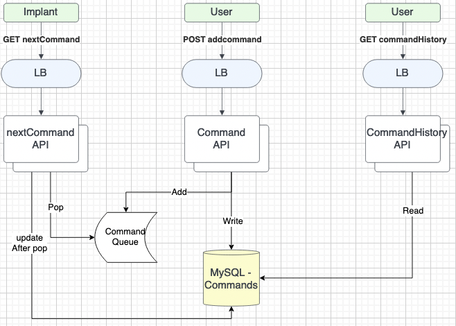

# Command Service
```
cd service-command
docker-compose build && docker-compose up -d
```  

## Command History
### Check In
```GET http://localhost:1000/commandHistory?```  
Side Effects:
- None
Returns:
- A JSON list of commands queued

### Add Command
```GET http://localhost:11000/addCommand?target=[TARGET_ID]&command=[COMMAND_TO_QUEUE]```  
Side Effects: 
- Queues a new command
- Write a command to DB
Returns:
- A JSON representation of a created command

### Next Command
```GET http://localhost:12000/nextCommand?target=[TARGET_ID]```  
Side Effects:
- Consumes a command from the queue
- Updates command's pending status in DB
Returns:
- A JSON representation of the next command, if available  
  
  
